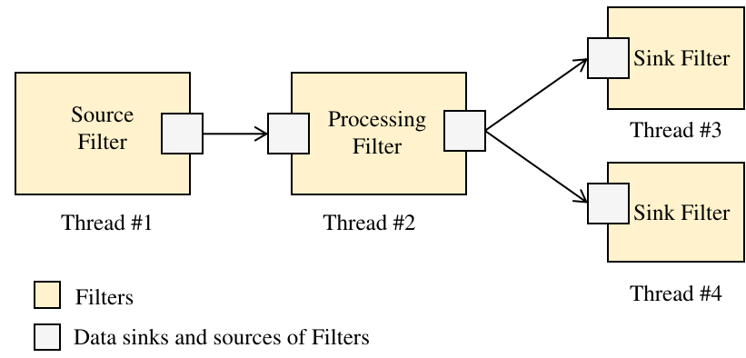

.. embedded-pipelines documentation master file, created by
   sphinx-quickstart on Fri Feb  2 12:16:29 2024.
   You can adapt this file completely to your liking, but it should at least
   contain the root `toctree` directive.

Introduction
====================================

The **Edge Processing Pipelines Framework (EPPF)** is a C++ library designed to build concurrent data processing pipelines for embedded pipelines applications in industrial environments. It provides a modular and flexible architecture to handle the challenges of near real-time data processing at the edge.

   Basic Edge Processing Pipeline.

The basic programming elements in this framework are `pipelines <https://en.wikipedia.org/wiki/Pipeline_(software)>`_, `filters <https://en.wikipedia.org/wiki/Filter_(software)>`_, and `queues <https://en.wikipedia.org/wiki/Message_queue>`_. **Pipelines** are sequences of processing elements, known as Filters, that define the data flow and transformation within an application. A **Filter** is an individual unit of processing that performs a specific operation on the data; the output of one Filter becomes the input to the next. **Queues** are configurable, thread-safe shared memory buffers that contain `n` equally-sized data messages. Queues facilitate communication between Filters, enabling the structured flow of data. This design allows complex data processing tasks to be broken down into modular, manageable steps, promoting efficient and parallel execution within the data stream.

The library includes a set of pre-implemented Filters for essential tasks such as file I/O, camera capture, display, and communication with external systems via OPC-UA or sockets. However, it is designed to be highly extensible. Developers can create their own Filters to meet specific application requirements. The framework’s documentation provides tutorials and guidelines to assist in developing custom Filters.

Key features:

- **Modular and Flexible Design**: Supports the development of custom Filters and Pipelines.
- **Low Latency and Efficient Data Processing**: Optimized for high-dimensional data with minimal memory copying between processing steps, maximizing the use of sequential memory operations.
- **Simplified Concurrent Programming**: Abstracts complexity, allowing flexible assignment of Filter tasks to threads.
- **Human-Readable Configuration**: Pipelines and Filters settings can be easily configured using YAML files.
- **Industrial Interoperability**: Supports seamless communication with industrial protocols via a Node Tree-based information model.
- **Support for Heterogeneous Data Sources**: Optional modules available for Genicam, OPC-UA, Modbus, Sockets, RTSP.
  
