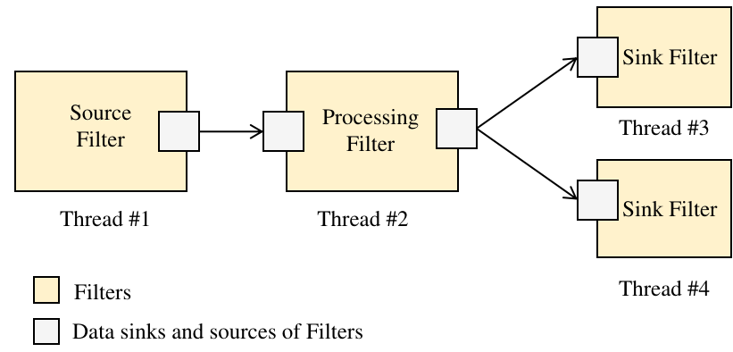

Core Components
###############

Pipeline
========

The Pipeline is the main structure that coordinates the execution of Filters and Queues.

A Pipeline is a sequence of interconnected processing elements, Filters, that orchestrates the flow of data. It can be visualized as a directed graph, where each filter represents a node and data flows through paths connecting the data sinks and sources of these filters. A data sink can connect to multiple data sources, but each data source can be linked to only one data sink.

The Pipeline is responsible for configuring this graph by setting up connections between filters' sinks and sources. It manages the execution logic by allocating threads and assigning tasks to them. Additionally, the Pipeline handles the operational status of filters as well as executing their respective tasks.

**Pipelines**: See api here :ref:`pipeline_api`



   Basic Edge Processing Pipeline.

Filter
======

Filters are modular units that perform specific tasks within the pipeline.

Filters are the fundamental processing units within a pipeline. They are instances of processing instructions that define specific operations to be performed on the data stream, known as 'jobs'. Each Filter has a configurable number of data source ports (inputs) and data sink ports (outputs).

The 'job' processes incoming data from the source ports and generates output on the sink ports, which can then be passed to other Filters. Ports serve as pointers to message Queues which manage concurrent access to the data, enabling Filters to be linked together into complex concurrent data processing pipelines. Additionally, Filters have 'settings' or control parameters that can be adjusted, allowing for real-time modifications to their operations.


   Filter architecture.

**Filters**: See api here :ref:`filter_api`

Settings
--------


Filter States
-------------


   Filter states and control methods.

Filters transition through several states during their lifecycle:

- **`d` disconnected**: 
  - The initial state where the Filter is not connected to any data sources or other Filters.
- **`c` connected**: 
  - The Filter has established connections with the device if (applicable).
- **`s` set**: 
  - The Filter has been configured with specific parameters and is ready to begin processing.
- **`r` running**: 
  - The execution of the Filter' job  is enable.

Filter Control Methods
----------------------

These methods control the transition of Filters between states:

- **Filter::Filter**: 
  - The constructor builds up the Filter’s settings by parsing a YAML configuration node and applying the settings.

- **open()**: 
  - Establishes communication with the device (if applicable).
  - Parses the YAML configuration to set device-specific settings.
  - Transitions the Filter to the connected state, enabling the connection of source queues to the Filter’s ports and preparing for data flow.

- **close()**: 
  - Closes communication with the device (if applicable), reverting the Filter to the disconnected state.

- **set()**: 
  - Checks the compatibility of the connected source queues.
  - Instantiates sink queues and allocates necessary resources, transitioning the Filter to the set state.

- **reset()**: 
  - Releases sink queues and resources, returning the Filter to the connected state.

- **start()**: 
  - Enables the execution of the Filter’s job, transitioning it to the running state.

- **stop()**: 
  - Disables the execution of the Filter’s job, halting data processing but retaining configuration.

- **connectSourceQueue()**: 
  - Connects a Queue to one of the Filter’s source ports, enabling it to receive data from the queue.


See api here :ref:`filter_api`

Queue
=====

Queues manage data flow between Filters, ensuring thread-safe communication.

Queues are instances of shared memory space in which and from which filters read and write data respectively.
Queues are implemented as flat circular buffers following the `monitor pattern <https://en.wikipedia.org/wiki/Monitor_(synchronization)>`_.

The Queue class provides a flexible implementation of a circular buffer designed to manage a queue of N messages, each with the same size and structure. It supports both LIFO (Last In First Out) and FIFO (First In First Out) queuing strategies, allowing multiple producers and consumers. Various configuration options for buffer management, blocking call behavior, and scheduling modes are available.

A queue is a “Monitor” (i. e. thread-safe class object) implementing a circular buffer with a mechanism for synchronization and signaling among filter elements (producers/consumers that can run in different threads). Queues provide a structured concurrent mechanism for sharing streaming data. They have been designed to minimize the latency and memory copies along the processing chain. Queues encapsulate circular buffers with streaming data and operations/procedures to exclusively manipulate the data. Besides, they provide synchronization between concurrent procedure invocations. The local procedures are the gateway to the shared data and called by the processes to access the resources. The architecture scheme of the Queues is shown in Fig. 6

The Queue is initialized through the InitQueue() procedure specifying different parameters as the data schema that will be used, number of data buffers in the queue or data buffer size in bytes. This procedure will allocate the circular buffer as a contiguous region of memory. The buffer memory can be pin memory to be shared among CPU and GPU or standard memory only for CPU.  The data schema describes how the information is serialized in the data buffer: e.g. images, features, combination of both, or any application specific data type.
Any threads/process that wants to use the queue will have to first make a subscription to the queue invoking the following procedures SubscribeProducer/Consumer(), UnsubscribeProducer/Consumer(). Once the subscription is made, the queue will create a status table for each producer/consumer with information regarding current pointer in the circular buffer, identification number, counter with buffers consumed or produced and number of available data buffers to read or write in the queue. Through the WriteLockPtr() and ReadLockPtr() the Producers/Consumers can get the position in the circular buffer where they can write or read new data. In order to reduce latency, the queue always return the latest data buffer copied to the queue, discarding previous available buffers if exists. If there is no data available in the queue, consumers will wait in the consumers queue (empty condition variable) and will be waked up when new data will be available, i.e. one producer invokes WriteUnlockPtr(). Producers will wait in the producers queue when the queue is full (full condition variable), i.e. input pointer of the producer has reached the output pointer of a consumer. The producer will wait in the queue until a consumer release one buffer ReadUnlockPtr().


Monitor.

.. code-block:: cpp
		
	startRead()
	// critical region
	endRead()
	...
	startWrite()
	// critical region
	endWrite()

The circular buffer enables writers, readers to access flat memory of given size.
The queue is a wrapper of the flat buffer that provide context information.

QueueWriter
------------

See api here :ref:`filter_api`

QueueReader
------------

See api here :ref:`filter_api`

.. code-block:: cpp
		
	writer = QueueWriter(queue)
	Message &msg = writer.startWrite()
	msg().print();
	writer. endRead()

This shared memory space have allocated a discrete number of **messages**. 

```cpp
class Queue
```
